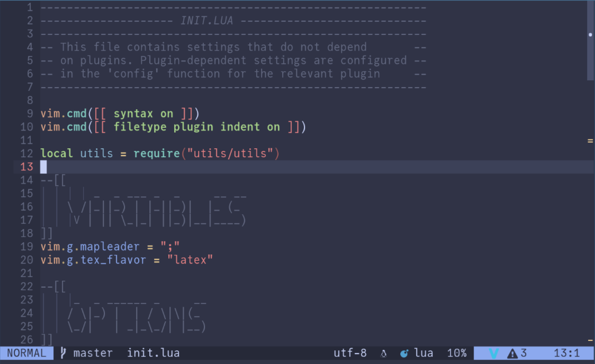

# mbc-colorscheme



A colorscheme that makes use of your pywal colors via the [wal-colors](https://github.com/mbrea-c/wal-colors.nvim) lua API.
Supports treesitter highlights, LSP semantic highlight tokens, rainbow brackets
and a variety of other plugins (Issues/PRs welcome if your favourite plugin is
not supported!)

## Installation

### lazy.nvim

Add a `mbc-colorscheme.lua` file to your plugin spec directory containing the
following:

```lua
return {
  "mbrea-c/mbc-colorscheme.nvim",
  dependencies = {
    { "mbrea-c/wal-colors.nvim" },
  },
  config = function()
    vim.cmd([[colorscheme mbc]])
  end,
  priority = 1000,
}
```
